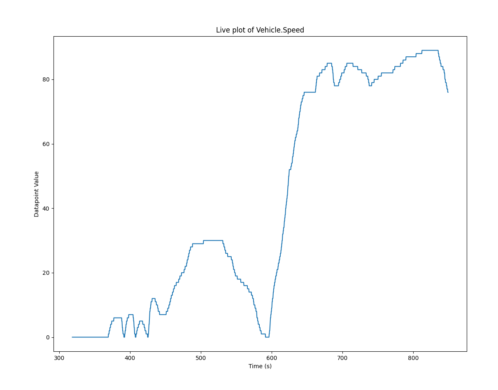

# VSS-Live-Plot

A simple Python utility that connects to the Kuksa Databroker and plots a single datapoint live for monitoring purporses.



# Installation

```shell
pip install -r requirements.txt
```

# Usage

Most basic usage is:

```shell
vss-live-plot.py <VSS_DATAPOINT_PATH>
```

e.g.

```shell
vss-live-plot.py Vehicle.Speed
```

# Configuration

There are no external configuration files for this script, but several customizable commandline options exist:

```shell
$ ./vss-live-plot.py --help
usage: vss-live-plot.py [-h] [-d DATABROKER_ADDRESS] [-u PLOT_UPDATE_MS] [-q PLOT_QUEUE_LENGTH] VSS_PATH

Live plots a single datapoint in the Kuksa databroker for monitoring purposes

positional arguments:
  VSS_PATH              VSS Datapoint to be plotted/monitored

options:
  -h, --help            show this help message and exit
  -d DATABROKER_ADDRESS, --databroker-address DATABROKER_ADDRESS
                        The address to the kuksa databroker. [DEFAULT: 127.0.0.1:55555]
  -u PLOT_UPDATE_MS, --plot-update-ms PLOT_UPDATE_MS
                        Interval at which the plot is updated (ms) [DEFAULT: 200]
  -q PLOT_QUEUE_LENGTH, --plot-queue-length PLOT_QUEUE_LENGTH
                        Number of points plotted at a time (history length) [DEFAULT: 200]
```